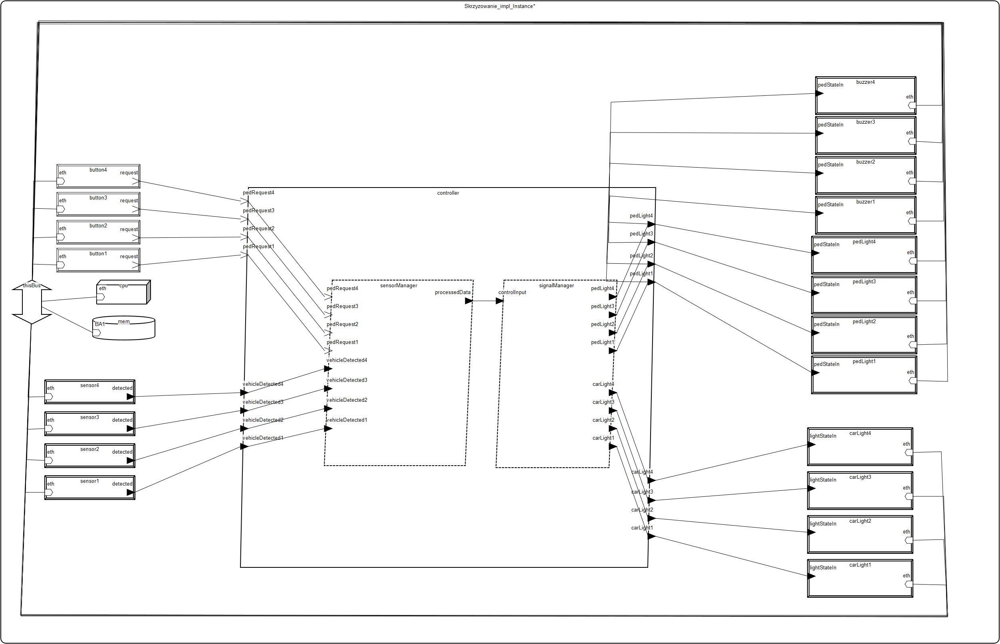

# Skrzyżowanie z sygnalizacją

Autor: Maciej Wilewski  
kontakt: mwilewski@student.agh.edu.pl

## Opis modelowanego systemu

### Opis ogólny

Model przedstawia system sterowania sygnalizacją świetlną na skrzyżowaniu z czterema wlotami. Każdy wlot jest wyposażony w:

- czujnik pojazdów,

- przycisk dla pieszych,

- sygnalizacja świetlna dla samochodów,

- sygnalizacja świetlna dla pieszych,

- buzzer dźwiękowy wspierający osoby niewidome.

System przetwarza dane z czujników i przycisków, podejmując decyzje o zmianie stanów świateł, które są przekazywane do odpowiednich urządzeń wykonawczych.

Komunikacja między komponentami odbywa się za pośrednictwem wspólnej magistrali Ethernet, a główne obliczenia realizuje procesor CPU. Pamięć oraz dwa wątki w ramach procesu kontrolera obsługują zarządzanie sensorami i sygnalizacją.

### Opis dla użytkownika

- System obsługuje realne zdarzenia z otoczenia skrzyżowania:

- Gdy czujnik wykryje pojazd, generuje odpowiedni sygnał do kontrolera.

- Naciśnięcie przycisku przez pieszego generuje żądanie przejścia.

- Kontroler analizuje dane, synchronizuje sygnalizację świetlną i wysyła nowe stany świateł do urządzeń.

- Sygnalizatory świetlne oraz buzzery dostosowują się zgodnie z poleceniem, zapewniając płynność ruchu i bezpieczeństwo pieszych.

## Spis komponentów AADL

### Magistrala komunikacyjna - EthernetBus

- Rola: Główna magistrala systemu, zapewniająca komunikację między wszystkimi komponentami.

- Funkcjonalność:

    - Przesyła dane między czujnikami, procesorem, pamięcią i urządzeniami wykonawczymi (światła, brzęczyki).
    
    - Zapewnia przepustowość 1 GB/s, co jest wystarczające dla systemu czasu rzeczywistego.

- Właściwości:

    - BandWidthCapacity => 1.0 GBytesps – maksymalna przepustowość.

    - BandWidthBudget => 50.0 MBytesps – zarezerwowane pasmo dla krytycznych komponentów.

    - GrossWeight => 0.5 kg – waga fizycznej magistrali.

### Pamięć systemowa - ControlMemory

- Rola: Przechowuje dane konfiguracyjne i stan systemu.

- Funkcjonalność:

    - Przechowuje aktualne stany świateł, historię zdarzeń (np. naciśnięcia przycisków), logi systemowe.

    - Współpracuje z CPU w celu przetwarzania danych z czujników.

- Właściwości:

    - GrossWeight => 0.1 kg – lekka pamięć wbudowana.

### Procesor (CPU) - CPU

- Rola: Centralna jednostka obliczeniowa, zarządzająca logiką systemu.

- Funkcjonalność:

    - Wykonuje algorytmy sterowania sygnalizacją świetlną.

    - Przetwarza dane z czujników i przycisków, decyduje o zmianach świateł.

- Właściwości:

    - MIPSCapacity => 8000.0 MIPS – wysoka wydajność dla systemu czasu rzeczywistego.

    - GrossWeight => 0.05 kg – lekki procesor wbudowany.

### Typy danych

#### VehicleDetection

- Rola: Przechowuje informację o wykryciu pojazdu (boolowski: true/false).

- Funkcjonalność:

    - Przesyłany z czujników do SensorManager, aby określić natężenie ruchu.

- Właściwości:

    - Data_Size => 1 Byte – minimalny rozmiar danych.

#### ProcessedSensorData

- Rola: Przetworzone dane z wielu czujników.

- Funkcjonalność:

    - Agreguje informacje z wszystkich czujników, aby SignalManager mógł podjąć decyzję o zmianie świateł.
- Właściwości:

    - Data_Size => 16 Byte

#### LightState (enum: RED, YELLOW, GREEN)

- Rola: Określa stan świateł samochodowych.

- Funkcjonalność:
    - Przesyłany z SignalManager do urządzeń CarLight.
- Właściwości:
    - Data_Size => 2 Byte

#### PedLightState (enum: WALK, DONTWALK)

- Rola: Określa stan świateł dla pieszych.

- Funkcjonalność:

    - Steruje światłami i brzęczykami (Buzzer), informując pieszych, czy mogą przejść.
- Właściwości:
    - Data_Size => 1 Byte

### Urządzenia wejściowe

#### VehicleSensor (4 sztuki)

- Rola: Wykrywa obecność pojazdów na pasach ruchu.

- Funkcjonalność:

    - Wysyła sygnał (VehicleDetection) do SensorManager w czasie rzeczywistym.

- Właściwości:

    - Period => 20 ms – częste aktualizacje danych.

    - GrossWeight => 0.15 kg – lekki czujnik wbudowany w jezdnię.

#### PedButton (4 sztuki)

- Rola: Przycisk dla pieszych zgłaszający żądanie przejścia.

- Funkcjonalność:

    - Generuje zdarzenie (event port), gdy zostanie naciśnięty.

- Właściwości:

    - GrossWeight => 0.2 kg – wytrzymały przycisk zewnętrzny.

### Urządzenia wyjściowe

#### CarLight (4 zestawy)

- Rola: Światła samochodowe (czerwone, żółte, zielone).

- Funkcjonalność:

  - Odbiera stan (LightState) od SignalManager i wyświetla odpowiednie światło.

- Właściwości:

  - Dispatch_Protocol => Sporadic – aktualizacja tylko przy zmianie stanu.

  - GrossWeight => 15.0 kg – ciężkie ze względu na konstrukcję.

#### PedestrianLight (4 zestawy)

- Rola: Światła dla pieszych (WALK/DONT WALK).

- Funkcjonalność:

  - Synchronizowane z CarLight, aby umożliwić bezpieczne przejście.

- Właściwości:

  - GrossWeight => 10.0 kg – lżejsze niż światła samochodowe.

#### Buzzer (4 sztuki)

- Rola: Brzęczyk dla osób niewidomych.

- Funkcjonalność:

  - Wydaje dźwięk, gdy światła dla pieszych zmieniają się na WALK.

- Właściwości:

  - GrossWeight => 0.3 kg – małe i lekkie urządzenie.

### Wątki przetwarzające

#### SensorManager

- Rola: Zbiera i przetwarza dane z czujników.

- Funkcjonalność:

  - Agreguje dane z VehicleSensor i PedButton, generując ProcessedSensorData.

- Właściwości:

  - Period => 20 ms – częste aktualizacje.

  - Compute_Execution_Time => 3 ms .. 6 ms – szybkie przetwarzanie.

#### SignalManager

- Rola: Decyduje o zmianach świateł na podstawie danych z SensorManager.

- Funkcjonalność:

  - Implementuje algorytm sterowania ruchem (np. priorytetyzacja pieszych).

- Właściwości:

  - Period => 50 ms – wolniejsze niż SensorManager (decyzje wymagają więcej czasu).

  - Compute_Execution_Time => 5 ms .. 10 ms – bardziej złożone obliczenia.

### Proces główny - TrafficController

- Rola: Integruje wszystkie komponenty systemu.

- Funkcjonalność:

  - Łączy SensorManager i SignalManager z urządzeniami wejściowymi/wyjściowymi.

  - Zarządza przepływem danych między magistralą, CPU i pamięcią.

### System główny - Skrzyzowanie

- Rola: Reprezentuje całe skrzyżowanie jako system.

- Funkcjonalność:

  - Zawiera wszystkie podzespoły (CPU, pamięć, czujniki, światła).

  - Konfiguruje priorytety pasma dla różnych komponentów.

- Właściwości:

  - WeightLimit => 115.0 kg – całkowita waga systemu.

  - Przydziały pasma dla każdego komponentu (np. 0.1 KBytesps dla czujników).

## Analiza modelu

### Bus Load

Magistrala ma bardzo duży zapas zasobów, ponieważ urządzenia nie wykorzystują dużo pasma, a standardowe dzisiejsze magistrale są potężnie zaopatrzone.

W przyszłości można wykorzystać tą samą magistralę do rozbudowy systemu.

### Not Bound Resource Budget Analysis

System wykorzystuje 50% CPU, zużycie to generuje logika sterująca.

### Test scheduability

Łączne obciążenie: 50% – procesor jest schedulowalny

Wątek sensorManager: 30%

Wątek signalManager: 20%

Wszystkie wątki zmieszczą się czasowo na procesorze.

### Weight totals

Całkowita masa systemu:

Suma: 103,25 kg

Limit: 115,00 kg

Zapas: 10,2%

Najcięższe komponenty:

Światła drogowe (carLight1–4) – po 15 kg

Światła dla pieszych (pedLight1–4) – po 10 kg

System spełnia wymagania masowe – nie przekracza limitu.

Największy udział wagowy mają sygnalizatory świetlne, co warto uwzględnić przy projektowaniu fizycznym.

W celu zmniejszenia wagi można rozważyć zamianę sygnalizacji z żarówkowej na ledową.

## Diagram

## Literatura:
https://zdmk.krakow.pl/wp-content/uploads/2019/10/Za%C5%82%C4%85cznik-nr-1-1.pdf
